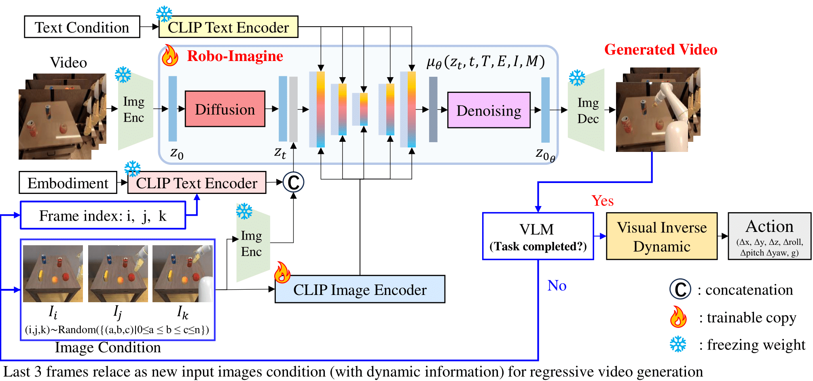

# Robo-Imagine: An Image-Text Conditioned, Generalized Robotic Video Generation Model Across Embodiments and Tasks

[](https://github.com/Egbert-Lannister/Robo-Imagine)
[](https://arxiv.org/abs/your-paper-id)
[](https://egbert-lannister.github.io/Robo-Imagine/)
[](https://modelscope.cn/)

<!-- > **English** | [中文](README_zh.md) -->

## 🚀 Code Coming Soon!

**⚠️ Important Notice: The source code for this project is currently under preparation and will be released soon. Stay tuned for updates!**

We are working hard to clean up the code, add comprehensive documentation, and ensure reproducibility. The complete implementation including:
- Model training scripts
- Inference pipelines
- Data preprocessing tools
- Evaluation metrics
- Pre-trained model weights

**Will be available in the coming weeks.** Please star this repository to get notified when the code is released!

## 📖 Abstract

Robot learning aims to complete diverse tasks. End-to-end VLA models, achieving significant performance, but struggling on data dependency. Recently, video generation models (VGMs) as a world model provides a new perspective, enabling robots to generalize across tasks by 'imagining' future states. However, computing bottleneck leading to limited-length video, not applicable for long-term tasks. In this paper, we train a image-text conditioned robotic video generation model, named **RoboImagine**, aiming to generate long-term robotic manipulation videos, with visual-semantic-dynamic conformity. We build an autoregressive long-term video generation pipeline based on a VLM as task-complete-verifier, in which RoboImagine is designed with dynamic and geometric consistency augmentation to get continuous and smooth motions between clips. Systematic experiments are implemented, showing that we are able to generate longe-term robotic manipulation videos with continuous motion, achieveing average success rate increment of 150% than that of w/o augmentation method. Our method effectively generalize on unseen cases. The generated video is mapped into end-effector actions, through a visual inverse dynamic model.

## 🎯 Key Features

- **Image-Text Conditioned Generation**: Generate robotic videos conditioned on both visual inputs and text instructions
- **Cross-Embodiment Generalization**: Works across different robot embodiments and manipulation tasks
- **Long-Term Video Generation**: Autoregressive pipeline for generating extended manipulation sequences
- **VLM-Enhanced Quality**: Vision-Language Model as task-completion evaluator
- **Dynamic Consistency**: Advanced augmentation techniques for smooth and continuous motions

## 🏗️ Framework



Robot-Imagine is a U-Net-based diffusion video generation model that takes:
- **Input**: Text instruction, embodiment specification, 3 condition images
- **Output**: Generated robotic manipulation video
- **Enhancement**: VLM as task-completion evaluator for autoregressive generation

## 📊 Results

### Performance Highlights
- **150% average success rate improvement** compared to methods without augmentation
- Effective generalization on unseen tasks and environments
- Successful evaluation on both RT-1 and Bridge datasets

### Datasets Evaluated
- **RT-1 Dataset**: 599 robotic manipulation videos with different embodiments and tasks
- **Bridge Dataset**: 513 robotic manipulation videos with various manipulation scenarios

## 🎬 Demo Videos

Our model demonstrates impressive performance across various manipulation tasks:

### RT-1 Dataset Results
- ✅ Pick and place operations
- ✅ Drawer manipulation (open/close)
- ✅ Object movement and positioning
- ✅ Container manipulation

### Bridge Dataset Results
- ✅ Kitchen appliance operation (fridge, microwave)
- ✅ Tool manipulation (knife, cutting board)
- ✅ Complex multi-step tasks
- ✅ Object arrangement and organization

### VLM vs No-VLM Comparison
Our VLM-enabled approach shows significant improvements in:
- Task completion accuracy
- Video quality and coherence
- Long-term temporal consistency

## 🛠️ Installation

**Coming Soon!** Installation instructions will be provided when the code is released.

```bash
# This will be available soon
git clone https://github.com/your-username/Robo-Imagine.git
cd Robo-Imagine
pip install -r requirements.txt
```

## 🚀 Quick Start

**Coming Soon!** Usage examples will be provided with the code release.

```python
# Example usage (coming soon)
from robo_imagine import RoboImagineModel

# Initialize model
model = RoboImagineModel.from_pretrained("path/to/model")

# Generate robotic video
video = model.generate(
    text_instruction="pick up the apple",
    condition_images=[img1, img2, img3],
    embodiment="robot_arm"
)
```

## 📋 Requirements

**Coming Soon!** Detailed requirements will be provided with the code release.

Expected requirements include:
- Python 3.8+
- PyTorch 2.0+
- Transformers
- Diffusers
- OpenCV
- NumPy
- Additional robotics and vision libraries

## 🔬 Experimental Setup

**Coming Soon!** Detailed experimental setup and reproduction instructions will be provided.

## 📈 Evaluation

**Coming Soon!** Evaluation scripts and metrics will be included in the code release.

## 🤝 Contributing

We welcome contributions! **Contributing guidelines will be available when the code is released.**

## 📄 Citation

If you find this work useful, please cite our paper:

```bibtex
@article{robo_imagine_2024,
  title={Robo-Imagine: An Image-Text Conditioned, Generalized Robotic Video Generation Model Across Embodiments and Tasks},
  author={[Authors will be added]},
  journal={[Journal/Conference will be added]},
  year={2024}
}
```

## 📞 Contact

For questions and inquiries, please contact:
- **Email**: [egbertlannister@gmail.com]
- **Issues**: Please use GitHub Issues for technical questions (available when code is released)

## 📝 License

This project is licensed under the MIT License. See the [LICENSE](LICENSE) file for details.

## 🙏 Acknowledgments

**Coming Soon!** Acknowledgments will be included in the final release.

---

**⭐ Don't forget to star this repository to stay updated on the code release!**

**📧 Subscribe to our notifications or watch this repository to be notified immediately when the code becomes available.** 